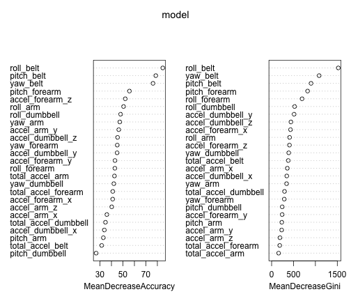

Title
========================================================

This is an R Markdown document. Markdown is a simple formatting syntax for authoring web pages (click the **Help** toolbar button for more details on using R Markdown).

When you click the **Knit HTML** button a web page will be generated that includes both content as well as the output of any embedded R code chunks within the document. You can embed an R code chunk like this:


```r
library(caret)
```

```
## Loading required package: lattice
## Loading required package: ggplot2
```

```r
library(randomForest)
```

```
## randomForest 4.6-10
## Type rfNews() to see new features/changes/bug fixes.
```

```r
trainData <- read.csv("data/pml-training.csv")
testData <- read.csv("data/pml-testing.csv")
set.seed(199)
trainIdx <- createDataPartition(y = trainData$classe, p = 0.75, list = FALSE)
trainSet <- trainData[trainIdx, ]
testSet <- trainData[-trainIdx, ]
model <- randomForest(classe ~ accel_forearm_y + accel_forearm_x + accel_forearm_z + 
    accel_arm_y + accel_arm_x + accel_arm_z + accel_dumbbell_y + accel_dumbbell_x + 
    accel_dumbbell_z + roll_arm + yaw_arm + pitch_arm + roll_belt + yaw_belt + 
    pitch_belt + roll_dumbbell + yaw_dumbbell + pitch_dumbbell + roll_forearm + 
    yaw_forearm + pitch_forearm + total_accel_forearm + total_accel_belt + total_accel_arm + 
    total_accel_dumbbell, data = trainSet, importance = TRUE, ntrees = 200)
pred <- predict(model, newdata = testSet)
```


You can also embed plots, for example:


```r
varImpPlot(model)
```

 


```
print(confusionMatrix(pred, testSet$classe))
```


